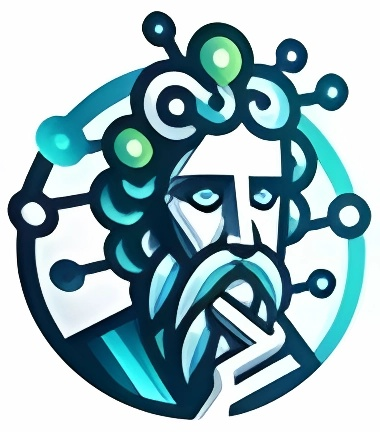

# Sokrates.ai

Sokrates.ai é uma plataforma que suporta a criação de aplicações conversacionais inteligentes que interagem de maneira socrática com os usuários,
facilitando e democratizando a geração de soluções de Inteligência Artificial (IA) por usuários não especialistas.

## Participantes

1. Claudio Dipolitto  
1. Geraldo Xexéo
1. Fabrício
1. Matheus Carvalho

## Sub-repositórios (tem que ser sincronizados independentemente)

1. Guia de Colaboração
1. Proposta de Projeto
1. Artigo de Revisão
